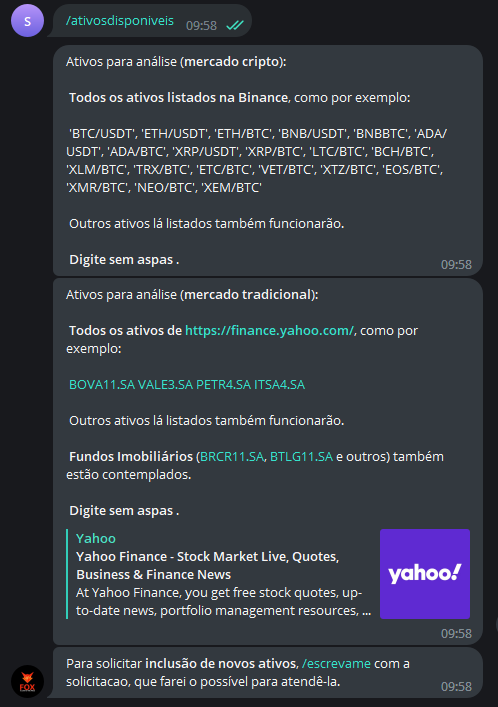

Este comando exibe uma lista de todos os possíveis ativos
que podem ser analisados e utilizados em conjunto com o 
Fox - A Link to the Price. 


Todos os ativos listados na Binance estão disponíveis
para análize, como por exemplo:

'BTC/USDT', 'ETH/USDT', 'ETH/BTC', 
'BNB/USDT', 'BNBBTC', 'ADA/USDT', 
'ADA/BTC', 'XRP/USDT', 'XRP/BTC', 
'LTC/BTC', 'BCH/BTC', 'XLM/BTC', 
'TRX/BTC', 'ETC/BTC', 'VET/BTC', 
'XTZ/BTC', 'EOS/BTC', 'XMR/BTC', 
'NEO/BTC', 'XEM/BTC' 
 
Outros ativos lá listados também funcionarão. 

Para o mercado tradicional (NYSE, B3 e outros), todos
os ativos disponíveis em https://finance.yahoo.com/, 
estão disponíveis, tais como: 

'BOVA11.SA', 'VALE3.SA', 'PETR4.SA', 'ITSA4.SA' e outros.

Fundos Imobiliários (BRCR11.SA, BTLG11.SA e outros) também estão contemplados. 


Para utilizá-lo, digite: 

```console
/ativosdisponiveis
```

E verá como saída: 

