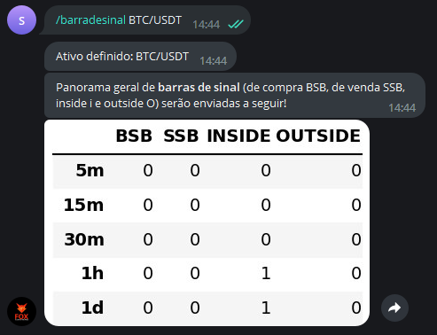

Este comando analisa a ocorrência de diferentes tipos de 
barra de sinal em um determinado ativo definido pelo usuário, em que:

1. **BSB** se refere a barra de sinal de compra
1. **SSB** contempla as barras de sinais de venda
1. **INSIDE** avalia a ocorrência de inside bar (barras internas)
1. **OUTSIDE** analisa se houve barras externas (outside bars)

Os tempos gráficos em questão são **M5, M15, M30, H1, D1**, em 
que "M" se refere a minutos, "H" a hora e "D" a dia.

Para utilizá-lo, digite: 

```console
/barradesinal ativo
```

Exemplo: 

```console
/barradesinal BTC/USDT
```

E verá como saída: 

