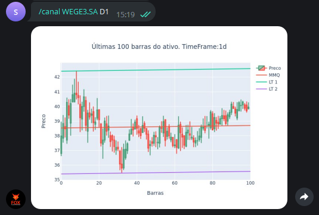

Este comando desenha um canal de melhor ajuste 
para um ativo, em um tempo gráfico determinado.

Os tempos gráficos em questão são **M5, M15, M30, H1, D1**, em 
que "M" se refere a minutos, "H" a hora e "D" a dia.

Para utilizá-lo, digite: 

```console
/canal ativo tempo_grafico
```

Exemplo: 

```console
/canal WEGE3.SA D1
```

E verá como saída: 

