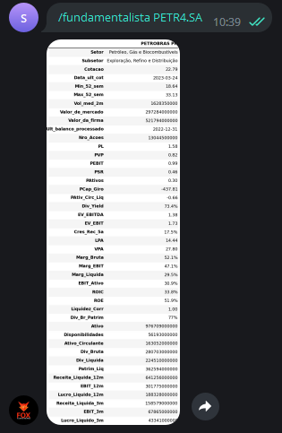
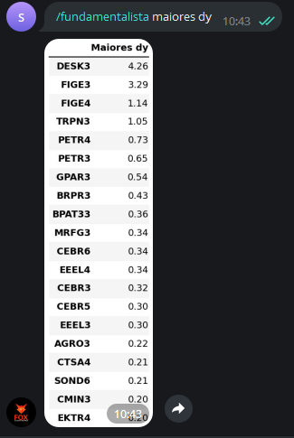

Este comando é capaz de retornar múltiplos (Análise Fundamentalista) 
de um dado ativo em questão, ou pode ser usado para 
rankear ativos do índice bovespa em função de um dado 
múltiplo. 

Para utilizá-lo existem diferentes formas:

```console
/fundamentalista ativo
```

Exemplo: 

```console
/fundamentalista PETR4.SA
```

Que terá como saída: 



Outras opções de uso são: 

```console
/fundamentalista maiores/menores indicador
```

em que indicador pode ser uma das seguintes variáveis:

- cotacao, pl, pvp, psr, dy, pa, pcg, pebit, pacl, evebit, evebitda, mrgebit, mrgliq, roic, roe, liqc, liq2m, patrliq, divbpatr, c5y

as quais representam os múltiplos. Por exemplo, o comando

```console
/fundamentalista maiores dy
```

retornará as ações com maiores Dividend Yield dentro do Ibovespa, 
conforme apresentado a seguir: 



O comando "maiores" pode ser substituido por "menores", fazendo com que 
tenhamos o retorno dos ativos que pagam menos dividendo, 
assim como o múltiplo pode ser alterado para qualquer
dentre os indicados acima.
