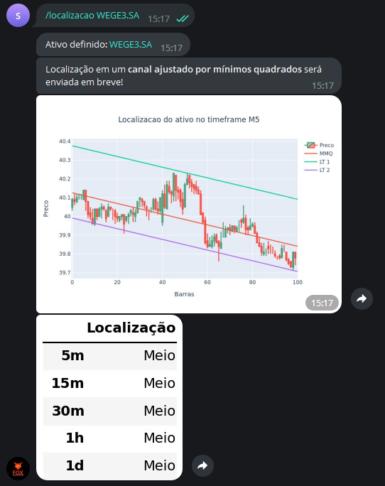

Este comando avalia a localização do preço 
de um determinado ativo em diferentes tempos gráficos. 

Os tempos gráficos em questão são **M5, M15, M30, H1, D1**, em 
que "M" se refere a minutos, "H" a hora e "D" a dia.

A localização pode ser "Alto", "Baixo" ou "Meio", 
conforme a localização em um canal de melhor ajuste.

Para utilizá-lo, digite: 

```console
/localizacao ativo
```

Exemplo: 

```console
/localizacao WEGE3.SA
```

E verá como saída: 

