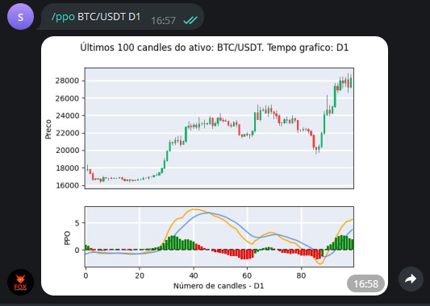

Este comando calcula o indicador 
Percentage Price Oscillator (PPO)
para as últimas 100 barras
de um ativo em questão, dado um tempo gráfico. 

Os tempos gráficos que podem ser utilizados  são: **M5, M15, M30, H1, D1**, em 
que "M" se refere a minutos, "H" a hora e "D" a dia.

Para utilizá-lo, escolha um dos comandos abaixo: 

```console
/ppo ativo time_frame 
/ppo ativo time_frame parametro_1 parametro_2 parametro_3
```

Em que: 

1. parametro_1 é o período longo.
2. parametro_2 é o período curto.
3. parametro_3 é o período para o sinal.

Caso parametro_i, para i=1,2 não seja definido pelo usuário, 
serão utilizados 26, 12 e 9 como valores padrão.

Exemplo: 

```console
/ppo BTC/USDT D1 
```

E verá como saída: 

