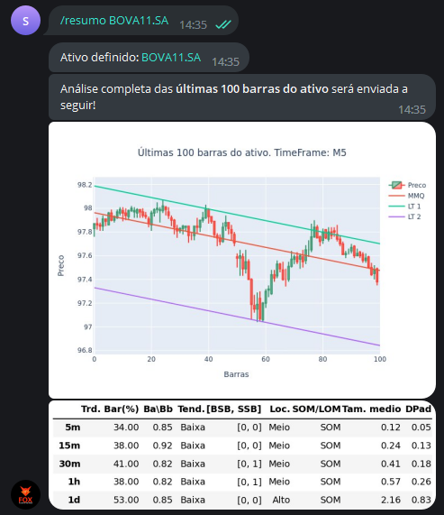

Este comando exibe uma análise resumida de um determinado 
ativo

Para utilizá-lo, digite: 

```console
/resumo ativo
```

Exemplo: 

```console
/resumo BOVA11.SA
```

E verá como saída: 



Com este comando você consegue um canal de 
melhor ajuste no tempo gráfico M5 (5 minutos), assim como uma análise
em diferentes tempos gráficos:

1. **5m, 15m, 30m, 1h e 1d**, em que "m" se refere a minutos, 
"h" a hora e "d" a dia.

2. **Trd. Bar (%)**, que apresenta o percentual de barras de tendência
nas últimas 100 barras/candles em todos os tempos gráficos analisados.

3. **Ba/Bb**, que analisa a relação entre barras de alta (Ba)
e barras de baixa (Bb) nas últimas 100 barras.

4. **Tend.**, que aponta a tendência das últimas 100 barras 
em todos os tempos gráficos analisados.

5. **[BSB, SSB]**, que aponta se há barra de sinal de compra (BSB)
ou barra de sinal de venda (SSB) em diferentes tempos gráficos 
(se "0", não há. Se "1", há barra de sinal).

6. **Loc.** indica a localização do preço em um canal de melhor ajuste nas últimas 
100 barras daquele ativo (meio do canal, alto ou baixo no canal).
   
7. **SOM/LOM**, que indica se o mercado é de ordem stop (SOM) ou limitada (LOM) 
naquele tempo gráfico. 

8. **Tam. medio** indica o tamanho médio das últimas 100 barras naquele tempo 
gráfico e **DPad** o desvio padrão 