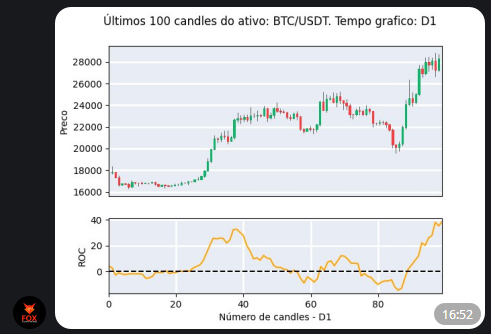

Este comando calcula o indicador Rate of Change (ROC) para as últimas 100 barras
de um ativo em questão, dado um tempo gráfico. 

Os tempos gráficos que podem ser utilizados  são: **M5, M15, M30, H1, D1**, em 
que "M" se refere a minutos, "H" a hora e "D" a dia.

Para utilizá-lo, escolha um dos comandos abaixo: 

```console
/roc ativo time_frame 
/roc ativo time_frame parametro_1
```

Em que: 

1. parametro_1 é o periodo utilizado no indicador


Caso parametro_1 não seja definido pelo usuário, 
será utilizado 12 como valor padrão

Exemplo: 

```console
/roc BTC/USDT D1 12
```

E verá como saída: 

