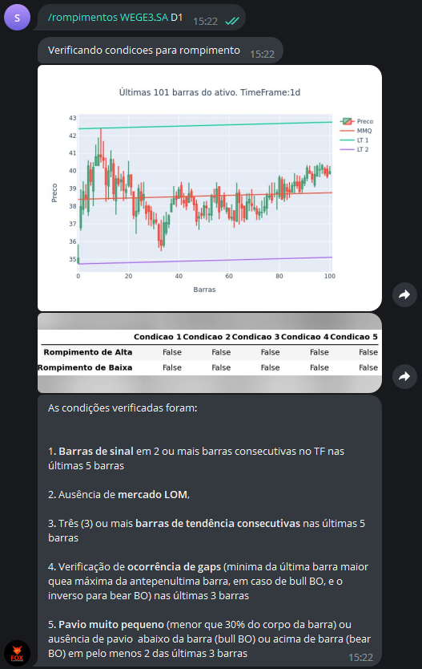

Este comando avalia cinco condições que tornam 
provável um rompimento bem sucedido. As condições são 
as que seguem: 

1. Barras de sinal em 2 ou mais barras consecutivas no tempo gráfico 
nas últimas 5 barras; 
 
2. Ausência de mercado de ordem limitada (LOM); 
 
3. Três (3) ou mais barras de tendência consecutivas nas últimas 5 barras; 
 
4. Verificação de ocorrência de gaps (minima da 
última barra maior que a máxima da antepenultima 
barra, em caso de rompimento de alta, e o 
inverso para rompimento de baixa) nas últimas 3 barras; 
 
5. Pavio muito pequeno (menor que 30% do 
corpo da barra) ou ausência de pavio 
abaixo da barra (rompimento de alta)  
ou acima de barra (rompimento de baixa) 
em pelo menos 2 das últimas 3 barras.

Tempos gráficos que podem ser escolhidos: **5m, 15m, 30m, 1h, 1d**, em 
que "m" se refere a minutos, "h" a hora e "d" a dia.

Para utilizá-lo, digite: 

```console
/rompimentos ativo tempo_grafico
```

Exemplo: 

```console
/rompimentos WEGE3.SA D1
```

E verá como saída: 

