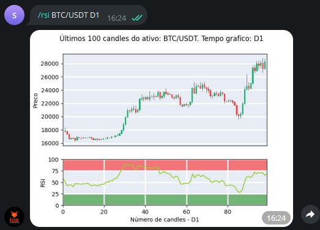

Este comando calcula o índice de força relativa (relative
strength index - rsi) para as últimas 100 barras
de um ativo em questão, dado um tempo gráfico. 

Os tempos gráficos que podem ser utilizados  são: **M5, M15, M30, H1, D1**, em 
que "M" se refere a minutos, "H" a hora e "D" a dia.

Para utilizá-lo, escolha um dos comandos abaixo: 

```console
/rsi ativo time_frame 
/rsi ativo time_frame periodo
```

Caso "periodo" não seja definido pelo usuário, o valor de
14 períodos será utilizado como padrão.

Exemplo: 

```console
/rsi BTC/USDT D1 14
```

E verá como saída: 

