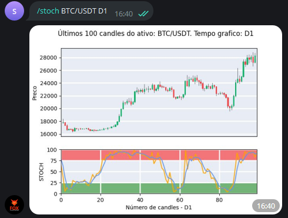

Este comando calcula o indicador estocástico (stoch)
para as últimas 100 barras
de um ativo em questão, dado um tempo gráfico. 

Os tempos gráficos que podem ser utilizados  são: **M5, M15, M30, H1, D1**, em 
que "M" se refere a minutos, "H" a hora e "D" a dia.

Para utilizá-lo, escolha um dos comandos abaixo: 

```console
/stoch ativo time_frame 
/stoch ativo time_frame parametro_1 parametro_2
```

Em que: 

1. parametro_1 é o periodo do estocástico
2. parametro_2 é o valor da janela da média móvel sobre %K

Caso parametro_i, para i=1,2,3 não seja definido pelo usuário, 
serão utilizados 14 e 3 como valores padrão

Exemplo: 

```console
/stoch BTC/USDT D1
```

E verá como saída: 

