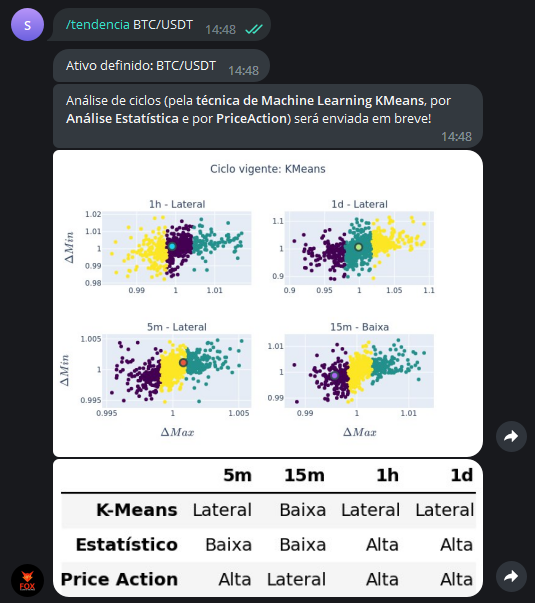

Este comando analisa a tendência (de alta, de baixa ou lateral) 
de um determinado ativo em diferentes tempos gráficos, 
utilizando três técnicas distintas (**K-Means, Estatístico, Price Action**)

Os tempos gráficos em questão são **5m, 15m, 1h, 1d**, em 
que "m" se refere a minutos, "h" a hora e "d" a dia.

Para utilizá-lo, digite: 

```console
/tendencia ativo
```

Exemplo: 

```console
/tendencia BTC/USDT
```

E verá como saída: 

