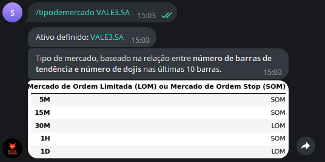

Este comando analisa o tipo de mercado em diferentes tempos gráficos. 
O mercado pode ser de ordem limitada (LOM) ou ordem stop (SOM), 
de acordo com as definições de Al Brooks. 

Os tempos gráficos analisados são: **5M, 15M, 30M, 1H, 1D**, em 
que "M" se refere a minutos, "H" a hora e "D" a dia.

Para utilizá-lo, digite: 

```console
/tipodemercado ativo
```

Exemplo: 

```console
/tipodemercado VALE3.SA
```

E verá como saída: 

