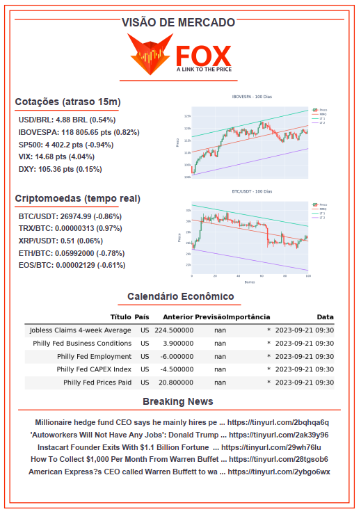

Este comando retorna um pdf que fornece uma visão geral do mercado no 
momento em que o mesmo foi gerado. Apresenta cotações de principais 
ativos (USD/BRL, IBOV, SP500, VIX e DXY) atrasados em 15 minutos, 
bem como cotações em tempo real de 5 criptomoedas (BTC/USD + outras 
4 moedas). 

Além disso, apresenta as próximas notícias e o horário em que 
as mesmas ocorrerão em um calendário econômico, classificado em 
termos de importância (* para a menos importante e *** para notícias
mais relevantes) e cinco títulos de notícias, com respectivos
links para os artigos completos.

Para utilizá-lo, digite o comando a seguir: 

```console
/visaodemercado
```

E verá como saída um pdf do tipo: 

